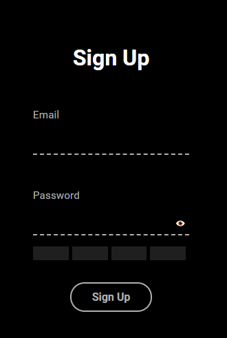

# Login Form Animation 
  My first app using Svelte, it's a form login made in Svelte using Javacript, HTML and CSS.


## Technologies
- Svelte 
- Javascript
- HTML
- CSS

## Get started

```
# Starting the project...

git clone https://github.com/r3nanp/loginform-animation.git
```

```
# Install the dependencies...

cd loginform-animation

yarn or npm install
```

```
# then start
yarn dev or npm run dev
```


### Screenshot 
  

### Link 
[Login Form](https://loginform-animation.vercel.app/)